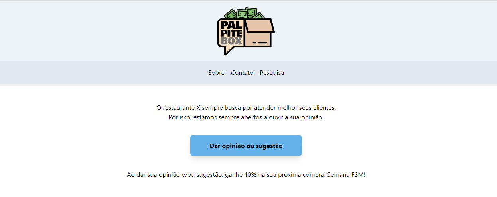

# PALPITE-BOX / SEMANA FULLSTACK MASTER

Este presente projeto foi construído com base nos frameworks NextJS && TailwindCSS, durante a Semana Fullstack Master, da DevPleno.

  

# Construído com:

 - NextJS
 - TailwindCSS
 - Google Sheets
 - PurgeCSS
 - Figma

# Autor

***Joramir da Silva Junior***

